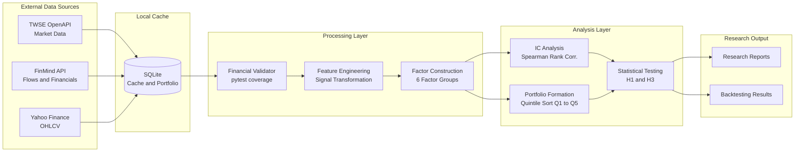
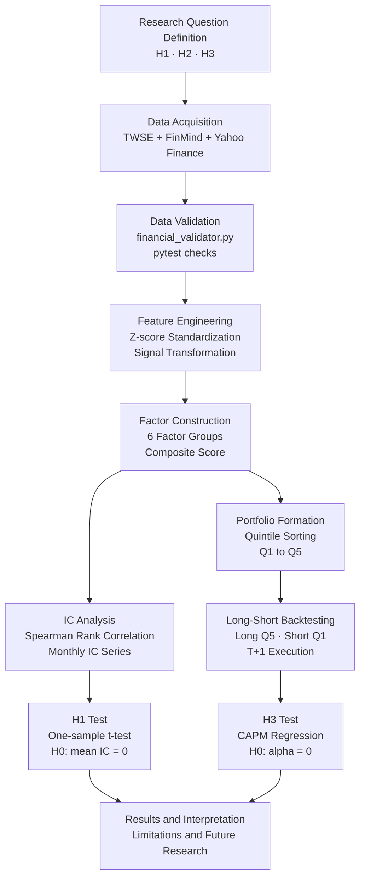
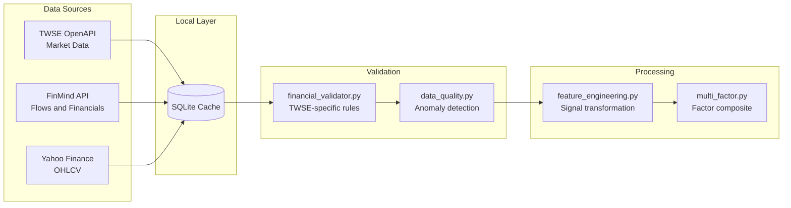
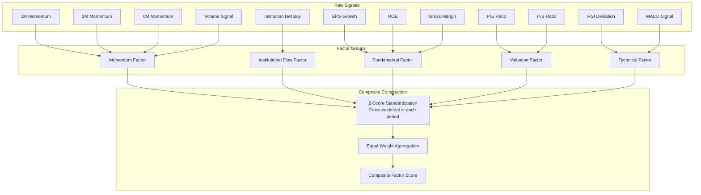
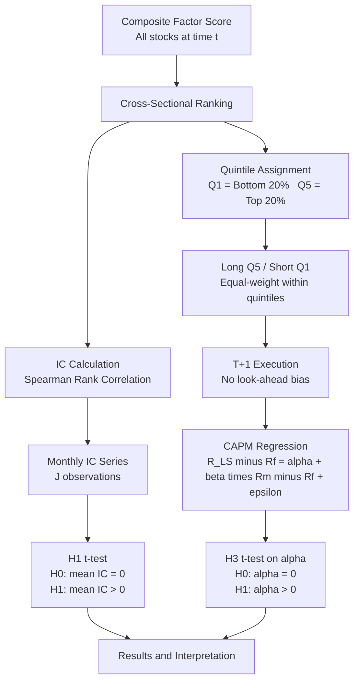
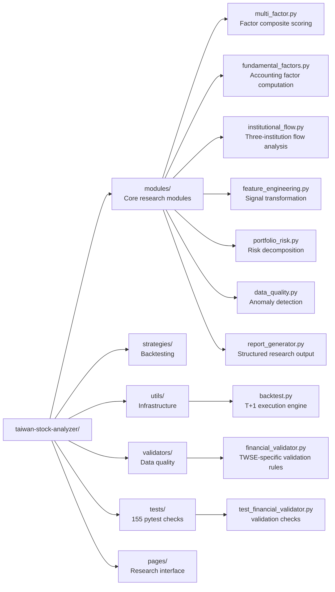

# Cross-Sectional Equity Factor Research Platform

> Empirical asset pricing research: cross-sectional factor construction,
> Information Coefficient analysis, and reproducible long-short portfolio
> backtesting for Taiwan Stock Exchange (TWSE) equities.

---

**Research Status**

| Phase | Description | Status | Key Metric |
|-------|-------------|--------|-----------|
| 0 - Exploratory | N=16 stocks, CAPM, 2022-2024 | Complete | IC=0.5429, alpha=102.84%* |
| 1 - Data Pipeline | Steps A-L, 10 modules | Complete | 155 passed, 1 warning |
| 1b - V1 Pilot | H1-H4 pilot run, N=16 | Complete | Pilot evidence only |
| 2 - Full-Market Study | N~900+, 10+ yr, FF5 | Not started / in development | Pending |
| 3 - Factor Refinement | LASSO, IC-weighted, OOS validation | Planned | Pending |
| 4 - Portfolio Optimization | Black-Litterman, transaction costs | Planned | Pending |

<sup>*Phase 0 exploratory result only. N=16, CAPM benchmark, 2022-2024 AI/technology bull market period.
Full methodological limitations are detailed in the Experimental Results section below.</sup>

---

## Portfolio Snapshot

This repository combines a Taiwan equity factor research pipeline with a Streamlit decision-support platform. The research side emphasizes reproducibility, T+1 backtest execution, snapshot-oriented data governance, and explicit bias controls for look-ahead, survivorship, selection, and data leakage risks. The application side surfaces the same research modules through interactive dashboards for market review, factor screening, backtesting, and portfolio risk analysis.

The reported Phase 0 and Phase 1 V1 results are pilot evidence for methodology development only. They are not investment advice and should not be interpreted as validated trading signals.

---

## Why This Repository Matters

- **Reproducible by design** - T+1 execution constraint, snapshot protocol, 155 passing pytest checks, and deterministic pipeline components.
- **Honest empirics** - Phase 0 and V1 pilot results are reported with methodological limitations and are not packaged as investment conclusions.
- **Taiwan-specific factor research** - Three-institution mandatory flow disclosure is operationalized as a quantitative factor signal.
- **Full research pipeline** - Raw multi-source API ingestion, financial validation, feature engineering, statistical testing, and report output live in one codebase.
- **Academic methodology** - Spearman IC analysis, quintile portfolio formation, and CAPM/FF5 alpha estimation follow standard asset-pricing conventions.
- **Progressive research design** - Phase 0 through Phase 4 roadmap escalates sample size, risk model specification, and validation rigor.

---

## Research Questions

**H1 - Information Coefficient Stability**
Do composite factor scores exhibit a positive and statistically significant Spearman rank correlation with subsequent stock returns across the cross-section of TWSE equities?

**H2 - Data Contamination Robustness**
Is the factor construction methodology robust to data quality irregularities inherent in TWSE market and financial reporting data?

**H3 - Long-Short Portfolio Abnormal Return**
Does a quintile-sorted long-short portfolio constructed from composite factor scores generate statistically significant abnormal returns after controlling for systematic risk?

---

## System Architecture



---

## Research Pipeline



---

## Experimental Results

### Research Progress Summary

| Hypothesis | Statistical Test | Phase 0 Result | Primary Limitation | Next Step |
|-----------|-----------------|---------------|-------------------|----------|
| H1 — IC Stability | Spearman t-test | ρ=0.5429, p=0.2972 | J=6 (severely underpowered) | Phase 2: J≥120 |
| H2 — Contamination | Quality filter test | NaN (Q=2 stocks) | Insufficient sample | Phase 2: full market |
| H3 — Portfolio Alpha | CAPM regression | α=102.84%, t=2.2335 | N=16, CAPM only, bull market | Phase 2: FF5, N≈900+ |

---

### Figure 1 — Monthly IC Series

> Phase 0 exploratory result · J=6 monthly observations
> Visualization will be generated following Phase 2 data collection (target: J≥120)

| Metric | Value | Interpretation |
|--------|-------|---------------|
| Mean Spearman IC | 0.5429 | Positive direction, consistent with H1 |
| p-value (one-sample t-test) | 0.2972 | Not significant at alpha=0.05 |
| IC observations (J) | 6 months | Severely underpowered; test has low statistical power |

The mean IC of 0.5429 is directionally consistent with the hypothesis. With only J=6 observations, the test is severely underpowered and the p-value of 0.2972 does not reach conventional significance thresholds. This result motivates Phase 2, which targets J≥120 monthly observations for adequate power.

---

### Figure 2 — Quintile Portfolio Cumulative Returns

> Phase 0 exploratory result · N=16 · 2022–2024 · CAPM benchmark
> Visualization will be generated following Phase 2 data collection

| Quintile | Annualized CAPM Alpha | t-statistic |
|----------|-----------------------|-------------|
| Q5 (Top) | 102.84% | 2.2335 |
| Q1 (Bottom) | 44.84% | 1.4095 |

> **Limitations that apply before interpreting this result:**
>
> 1. **Sample size:** N=16 pre-selected stocks — not a random or representative TWSE sample; result is not generalizable
> 2. **Market regime:** 2022–2024 coincides with a global AI/technology sector bull market; reported alpha likely reflects concentrated sector exposure rather than factor alpha
> 3. **Benchmark:** CAPM (single market factor) only — FF5 has not been applied; size, value, profitability, and investment factor loadings are not controlled
> 4. **Transaction costs:** Not modeled — gross alpha overstates implementable performance
> 5. **Phase 2** will re-estimate all three hypotheses with N≈900+, 10+ years of data, FF5 risk adjustment, and transaction cost modeling

---

## Methodology

### Data



| Source | Data Coverage | Update Frequency | Notes |
|--------|--------------|-----------------|-------|
| FinMind API | Institutional flows, financial statements, monthly revenue | T+1 | Free tier; rate-limited |
| TWSE OpenAPI | Daily market summary, advance/decline ratio | T+0 post-market | Official exchange data |
| Yahoo Finance | OHLCV, adjusted prices | ~15-min delay | Free tier |
| SQLite (local) | Computation cache, portfolio records | Session-persistent | No external dependency |

All missing values are reported as N/A. No silent imputation or forward-filling is applied without explicit documentation.

---

### Factor Construction



| Factor Group | Signals | Data Source |
|-------------|---------|-------------|
| Momentum | 1M, 3M, 6M price momentum; volume momentum | Yahoo Finance |
| Institutional Flow | Foreign institution, investment trust, dealer net position | FinMind API |
| Fundamental | EPS, ROE, gross margin, revenue YoY growth | FinMind API |
| Valuation | P/E ratio, P/B ratio | FinMind API |
| Technical | RSI deviation, MACD signal, moving average spread | Computed |
| Composite | Equal-weighted standardized scores across all groups | Derived |

Individual factor scores are cross-sectionally standardized (z-scored) before equal-weighted aggregation. IC-weighted and LASSO-regularized weighting are identified as Phase 3 extensions.

---

### Cross-Sectional Information Coefficient

Following Grinold and Kahn (2000), the Information Coefficient at period t is:

```
IC_t = Spearman_rank_corr(Composite_Score_{i,t}, Return_{i,t+1})
       for i in {stock universe at time t}
```

H1 is evaluated via a one-sample t-test on the IC time series:

```
H0: mean(IC) = 0     H1: mean(IC) > 0
```

---

### Portfolio Construction

Stocks are sorted into quintiles (Q1=lowest score, Q5=highest score) by composite factor score at each rebalancing date. The long-short portfolio is long Q5 and short Q1, equal-weighted within quintiles. All positions are entered on the trading day following the signal date (T+1 constraint), eliminating look-ahead bias.

---

### Statistical Inference



**H1 (IC Stability):** One-sample Spearman t-test on the IC series mean.

**H3 (Portfolio Alpha):** CAPM time-series regression of long-short portfolio excess returns. Jensen's alpha (intercept) and its t-statistic are the primary test statistics for H3.

---

### Validation

All input data passes through `validators/financial_validator.py`, which enforces rules for price continuity, trading halt flags, return outlier thresholds, and data gap patterns specific to TWSE reporting conventions. The validation layer is covered by the project pytest suite. The current baseline is `155 passed, 1 warning`; the warning is a local `.pytest_cache` permission issue, not a functional or test failure.

---

## Repository Structure



```
taiwan-stock-analyzer/
│
├── modules/                         # Core research modules
│   ├── multi_factor.py              # Multi-factor composite construction and scoring
│   ├── fundamental_factors.py       # Fundamental accounting factor computation
│   ├── institutional_flow.py        # TWSE three-institution net flow analysis
│   ├── feature_engineering.py       # Signal transformation and feature construction
│   ├── portfolio_risk.py            # Portfolio risk decomposition and attribution
│   ├── data_quality.py              # Data quality assessment and anomaly detection
│   ├── predictor.py                 # Cross-sectional scoring and ranking model
│   ├── report_generator.py          # Structured research output generation
│   └── explainability.py            # Factor contribution decomposition
│
├── strategies/                      # Backtesting strategy implementations
│   ├── ma_strategy.py               # Moving average crossover
│   ├── rsi_strategy.py              # RSI mean-reversion (confirmed and threshold variants)
│   └── macd_strategy.py             # MACD signal crossover
│
├── utils/
│   ├── backtest.py                  # T+1 execution backtest engine (no look-ahead bias)
│   ├── indicators.py                # Technical indicator computation
│   └── data_fetcher.py              # API retrieval with SQLite caching layer
│
├── validators/
│   └── financial_validator.py       # Financial data validation (TWSE-specific rules)
│
├── tests/
│   └── test_financial_validator.py  # Unit test suite (pytest, 145 cases)
│
├── pages/                           # Research interface modules (Streamlit)
├── app.py                           # Research environment entry point
├── ARCHITECTURE.md                  # System architecture documentation
├── Dockerfile                       # Containerized deployment
└── requirements.txt
```

---

## Reproducibility

| Property | Implementation |
|----------|---------------|
| Test framework | pytest baseline: `155 passed, 1 warning` |
| Look-ahead prevention | T+1 execution constraint in all backtesting |
| Pipeline determinism | All computations are deterministic given fixed input data |
| Data transparency | Missing values reported as N/A; no silent imputation |
| Validation layer | `validators/financial_validator.py` with documented rule specifications |
| Environment | `requirements.txt`, `Dockerfile` for reproducible setup; warning is local `.pytest_cache` permission only |

---

## Current Limitations

| Limitation | Detail |
|-----------|--------|
| Sample size | N=16 (Phase 0 only). Insufficient for cross-sectional inference. |
| Estimation window | Approximately 2 years (2022–2024). Insufficient for factor cycle evaluation. |
| Market regime | Overlaps with AI/technology sector bull market; results may be period-specific. |
| Risk model | CAPM only. Fama-French 5-factor adjustment pending Phase 2. |
| H2 result | Contamination test infeasible at Phase 0 sample size (NaN). |
| Transaction costs | Not modeled. All reported alpha is gross of execution costs. |
| Portfolio constraints | No liquidity filter, market impact model, or capacity constraint applied. |
| Factor weighting | Equal-weighted composite. Optimal weighting not yet investigated. |
| Selection bias | Phase 0 stock selection is non-random and may introduce sampling effects. |

---

## Future Research

### Phase 1 - Reproducible Data Pipeline and V1 Pilot (Complete)

Implemented an end-to-end, fully reproducible data pipeline for TWSE equity research:
- Steps A through L: raw data ingestion, parsing, cleaning, financial validation, feature engineering, and factor computation
- 10 modular components with standardized interfaces
- Current pytest baseline: `155 passed, 1 warning` (`.pytest_cache` permission warning only)
- Deterministic execution: identical outputs given the same input data across runs

### Phase 2 - Full-Market Empirical Study (Not started / in development)

Scale the empirical analysis to the full TWSE universe:
- Stock universe: all TWSE-listed equities (N approximately 900+)
- Estimation period: 10+ years for factor cycle coverage and adequate statistical power
- Risk model: Fama-French 5-factor (Fama and French, 2015) for alpha decomposition
- Re-test H1, H2, H3 with statistically adequate sample sizes
- Incorporate transaction cost assumptions (proportional and fixed cost models)
- Apply FF5 factor loadings to separate true factor alpha from style exposures

### Phase 3 — Factor Refinement (Planned)

- IC-weighted factor aggregation as an alternative to equal weighting
- LASSO and Ridge regularization for factor weight optimization
- Rolling-window out-of-sample cross-validation for stability assessment
- Factor redundancy analysis via pairwise IC correlation matrix

### Phase 4 — Portfolio Construction and Market Simulation (Planned)

- Mean-variance and minimum-variance portfolio optimization
- Black-Litterman framework integrating composite factor views as investor signals
- Transaction cost-aware rebalancing frequency optimization
- Market impact estimation for institutional-scale position sizing
- Comparison against TWSE capitalization-weighted index benchmark

---

## Setup

```bash
conda create -n twse-research python=3.11 -y
conda activate twse-research
pip install -r requirements.txt
streamlit run app.py
```

See [ARCHITECTURE.md](ARCHITECTURE.md) for detailed system design documentation.

---

## Data Sources

Data is retrieved at runtime via API calls. Raw data files are not included in this repository.

| Source | Access | Notes |
|--------|--------|-------|
| FinMind API | Free tier (rate-limited) | Institutional flows, financial statements |
| TWSE OpenAPI | Public (government open data) | Daily market summary, advance/decline |
| Yahoo Finance | Free tier | OHLCV, adjusted prices |

---

## References

- Fama, E. F., and French, K. R. (1992). The cross-section of expected stock returns. *Journal of Finance*, 47(2), 427–465.
- Fama, E. F., and French, K. R. (2015). A five-factor asset pricing model. *Journal of Financial Economics*, 116(1), 1–22.
- Grinold, R. C., and Kahn, R. N. (2000). *Active Portfolio Management* (2nd ed.). McGraw-Hill.
- Hou, K., Xue, C., and Zhang, L. (2020). Replicating anomalies. *Review of Financial Studies*, 33(5), 2019–2133.

---

## Disclaimer

This project is conducted for academic research and educational purposes only. All analysis is based on historical data and does not constitute investment advice. Phase 0 results reported above are preliminary exploratory findings and should not be interpreted as validated empirical conclusions.
